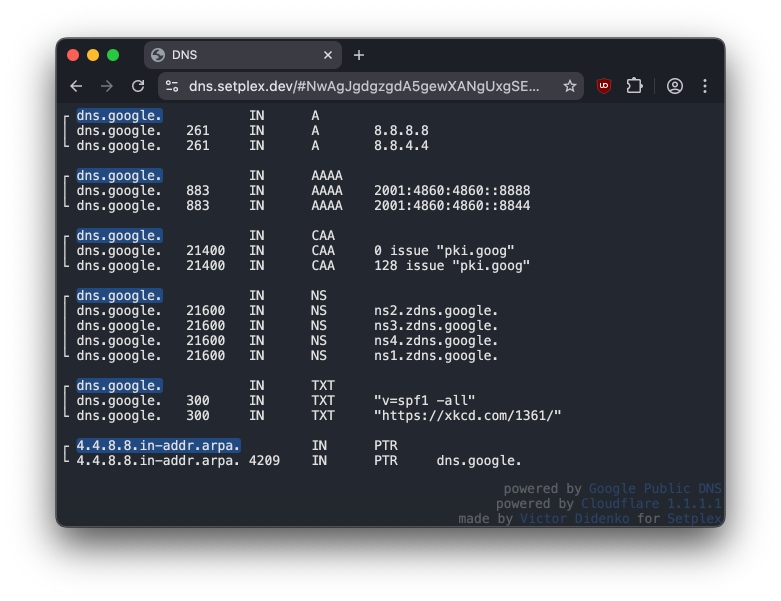
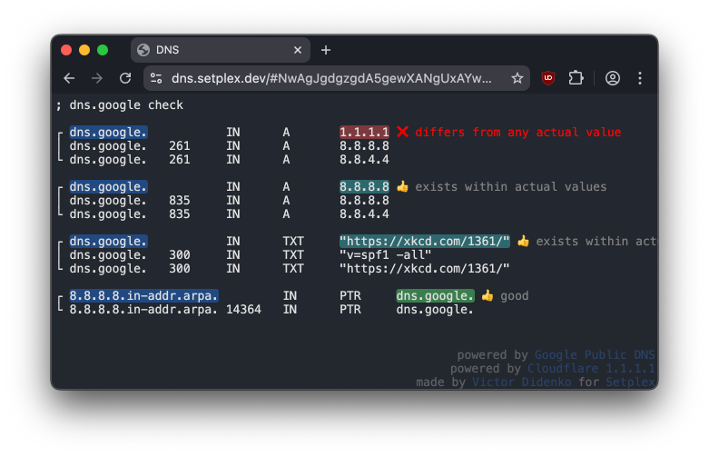
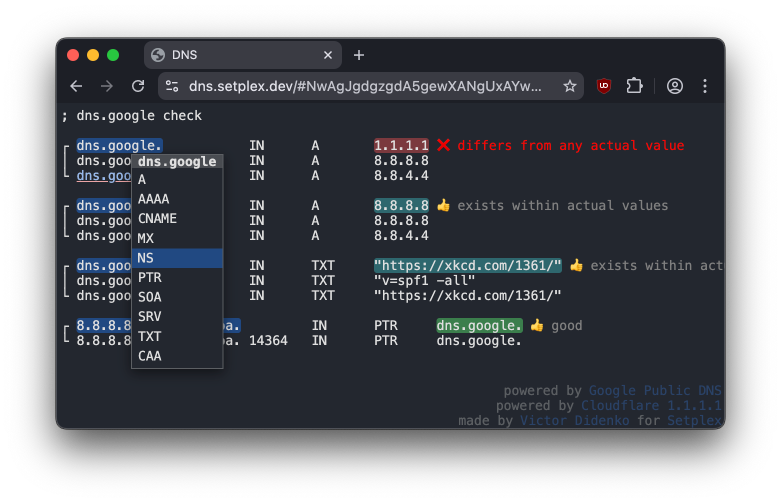

# DNS Query Tool

[https://dns.setplex.dev](https://dns.setplex.dev)

A simple, powerful web-based DNS lookup utility that lives in a single HTML page. Query DNS records, validate configurations, and share results with a single URL.



## Features

### 🔍 Simple Queries

Type a domain and hit Enter to get `A` records instantly:

```
google.com
```

Specify the record type:

```
google.com ns
google.com mx
google.com aaaa
```

### ✅ DNS Validation

Verify that DNS records match expected values - perfect for when you need to confirm DNS changes or share validation instructions:

```
mail.google.com txt "google-site-verification=PncXpRKRCAlDAdlesTtNFf6k9TvgxgcRfojdaKkEACY"
google.com a 142.250.185.46
```

The tool compares actual DNS results against your expected values and highlights:

- 👍 good (exact matches)
- 👍 exists within actual values
- ❌ differs from actual value
- ❌ differs from any actual value



### 🔗 Shareable URLs

All queries are encoded in the URL, making it easy to:

- Share DNS validation checks with colleagues
- Bookmark frequently-used queries
- Refresh the page to revalidate all results

### 🖱️ Interactive Navigation

Hold **Ctrl** to enable interactive mode:

- All domains and IP addresses on the page become clickable
- Click any domain or IP to open a context menu
- Select the DNS record type you want to query
- Context menu intelligently suggests relevant record types (`PTR` for IPs, `A` for domains)



### 🎯 Smart Features

- **Nested domain navigation**: Click different levels of a domain (`subdomain.example.com` → `example.com`)
- **IPv4 and IPv6 support**: Query both address types, including PTR lookups
- **CIDR notation detection**: Recognizes IP ranges in DNS records
- **Automatic `.arpa` domain handling**: Converts IPs to reverse DNS format for PTR queries

## Supported Record Types

- `A` - IPv4 addresses
- `AAAA` - IPv6 addresses
- `CNAME` - Canonical name records
- `MX` - Mail exchange records
- `NS` - Name server records
- `PTR` - Reverse DNS lookups
- `SOA` - Start of authority records
- `SRV` - Service records
- `TXT` - Text records
- `CAA` - Certificate authority authorization

## Usage Examples

### Basic lookup

```
dns.google
```

### Multiple queries

```
dns.google a
dns.google aaaa
dns.google ns
```

### Validation check

```
dns.google a 8.8.8.8
dns.google a 8.8.4.4
dns.google aaaa 2001:4860:4860::8888
```

### Reverse DNS

```
8.8.8.8 ptr
```

### Mail configuration

```
gmail.com mx
gmail.com txt
```

## Sponsored

[](https://setplex.com/)

[Setplex OTT Platform](https://setplex.com/)
